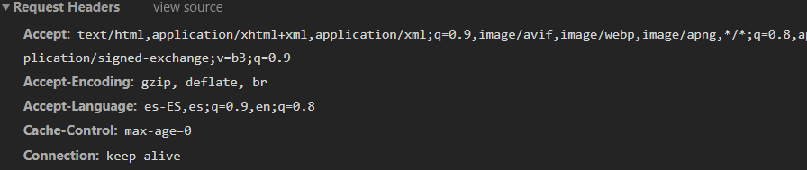
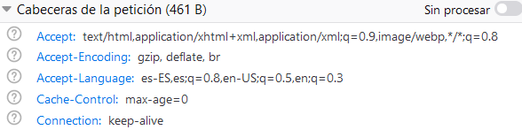

# Uso del navegador para el desarrollo web

## Introduccion

En esta practica se pide acceder a una pagina web, en la cual se tiene que usar dos navegadores `Google Chrome` y `Firefox`, para poder responder a las siguientes preguntas: 

## Desarrollo

1. ¿Que peticiones desencadena la consulta?

La página realiza sólo peticiones de tipo `GET`

### Chrome

### Firefox

2. ¿Qué tipo de petición estas realizando?

Se realizan tres tipos de peticiones: 
* HTML
* JPEG
* CSS

### Chrome

### Firefox

3. ¿Qué codigo de estatus devuelve?

El código de estatus que devuelve son:
* 302: Found
* 304: Not Modified
* 404: Not Found

### Chrome

### Firefox

4. ¿Qué DNS tiene el servidor?

El DNS, o `Domain Name System` es: http://www3.gobiernodecanarias.org/

### Chrome

### Firefox

5. ¿Qué IP tiene el servidor?

La dirección del servidor de esta página en concreto es: `93.188.136.129:443`

### Chrome

### Firefox

6. ¿La página tiene alguna cookie?, ¿Cuáles?

Sí, la página tiene Cookies, la cookie en cuestión es **ASP.NET_SessionId** con un value de `ahn4sqp2bvt2j2ehrlvfgte0`

### Chrome

### Firefox

7. Que idioma acepta?
Acepta dos tipos de idiomas, español e inglés.
* Español
* Inglés

### Chrome

### Firefox

8. Alguna línea de codigo JavaScript

### Chrome

### Firefox

9. Alguna línea de codigo CSS que se aplique

### Chrome

### Firefox

10. Alguna línea de codigo HTML que se aplique

### Chrome

### Firefox

